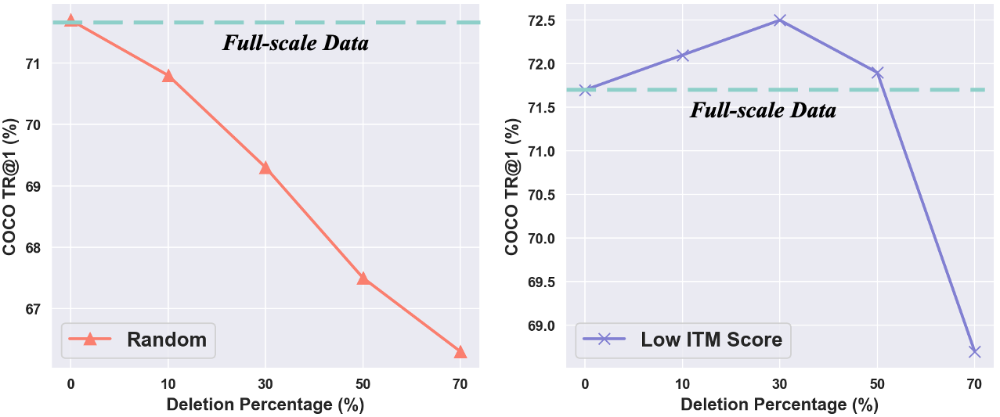
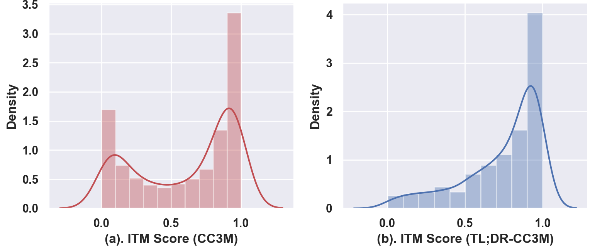

# Data-Centric Vision-Language Pre-training




- **At least half of the samples in the well-cleaned dataset (CC3M, refined from 5 billion images with 0.0006 preserved) negatively affect the learned rpresentation!**

- The purpose of this project is to **<span style="color:green">compress existing Large-scale Vision-Language Pre-training dataset</span>** without drop the performance.
We want the communtity pay more attention to data.


> This work **is still in progress**, now the compression rate is around 70%-80%.

> However, the data selection strategy is quite simple, we are exploring more sloid methods.

> We also focus on refine existing dataset with our toolbox [Image2Paragraph](https://github.com/showlab/Image2Paragraph).

## News
08/17/2023: Code released.

## To do
- Website.
- Show referenced generated_annotation_file.

## 1. Introduction
### 1. Conventional Vision-language Datasets

|Index|Original Dataset| #Original Samples|Reduced-Dataset|#Reduced Samples| Compressison Rate|
|--|--|--|--|--|--|
|0|CC3M|2.82M|TL;DR CC3M|0.67M|76.25%|
|1|CC12M|10.8M|TL;DR CC12M|2.4M|77.8%|
|2|YFCC|14.9M|TL;DR YFCC|2.5M|83.33%|
|3|LAION-Sub|40M|TL;DR LAION-Sub|8.04M|79.90%|


### 2. Data-efficient learning methods

"Large-scale" means that the methods are effective when used on datasets that are very large in size. 
The "task agnostic" means that the methods can be used regardless of the specific downstream task, and without any prior exposure to the associated data.

| Method                   | Year | Data Type     | Compression Ratio | Task Agnostic | Large-scale | Supervision       | Generation/Selection |
|--------------------------|------|---------------|-------------------|---------------|-------------|-------------------|----------------------|
| Dataset Distillation [1] | 2017 | Image         | 99%-99.99%        | No            | No          | Class Label       | Generation           |
| Data Pruning [2]         | 2022 | Image         | 20%-30%           | No            | Yes         | Class Label       | Selection            |
| Neural Data Server [3]   | 2020 | Multi-modality | 94%-98%          | No            | Yes         | Image-text Pairs  | Selection            |
| TL;DR (ours)         | 2023   | Multi-modality | 75%-90%          | Yes           | Yes         | Image-text Pairs  | Generation+Selection |

[1] Wang T et al. Dataset distillation[J]. arXiv preprint arXiv:1811.10959, 2018. 

[2] Sorscher B et al. Beyond neural scaling laws: beating power law scaling via data pruning[J]. NeurIPS, 2022.

[3] Yan X, et all . Neural data server: A large-scale search engine for transfer learning data[C]. CVPR. 2020.


##  2. Run

### Step 1. Pre-train Codebook-based Vision-Language Model

The codebook implementation is from VQ-VQE.


Please follow [GETTING_START.md](GETTING_START.md) for data preparation and captioner model training.


### Step 2. Codebook Extractor

```
python codebook_extractor.py
```

### Step 3. Codebook Clustering and Selection

```
python codebook_cluster.py
```
In comparison, use random selection also

```
python random_selection.py
```

### Step4. Fine-tuning VLP Model on Human-cleaned Captioning Dataset

```
python vq_compress_model/train_caption.py
```

### Step5. Generate Training Json 
```
python generate_train_json_w_caption.py
```

We show the ITM score distribution as below:


The main reason for the following steps is to higher the matching score. This not limited to image captioner, nueral data server and other techniques to improve the alignment between visual and text also works.

### Step6. Pre-training and Evaluating on downstream Tasks

Use the generated annotation files to train VLP model in normal way.

## 3. Some Result

#### a. CC3M

|Dataset|Sample|Pretraining Time|COCO TR@1|COCO IR@1|COCO Captioning B@4|NLVR2|
|--|--|--|--|--|--|--|
|CC3M|2.82M|19H|70.9|54.3|36.8|76.2|
|TL;DR CC3M|0.67M|4.7H|72.8|54.8|37.6|78.0|

#### b. CC12M

|Dataset|Sample|Pretraining Time|Flickr TR@1|Flcikr IR@1|COCO Captioning B@4|NLVR2|
|--|--|--|--|--|--|--|
|CC12M|10.8M|65H|84.7|75.3|37.5|78.9|
|TL;DR CC12M|2.4M|14H|85.5|76.3|38.1|78.5|


#### c. YFCC
Compression Rate: 83.33%


#### d. LAION-Subset
Compression Rate: 80%


## Acknowledgement

This work is mainly inspired by [Dataset Distillation](https://arxiv.org/abs/1811.10959) and [Data Pruning](https://arxiv.org/abs/2206.14486).
The architecutres ablation are mainly based on [blip](https://github.com/salesforce/BLIP), and [ViLT](https://github.com/dandelin/ViLT).
Thanks for these good works.

## Citation

If you find our work helps, please use the following BibTeX entry for citation.

```
@article{wang2023tldr,
  title={Too Large; Data Reduction for Vision-Language Pre-Training},
  author={Alex Jinpeng Wang, Kevin Qinghong Lin, David Junhao Zhang, Stan Weixian Lei and Mike Zheng Shou },
  journal={ICCV},
  year={2023}
}
```